# Teams Proactive Messaging - Documentación

## 🎯 Descripción

Sistema que permite enviar mensajes proactivos a las conversaciones de Teams desde las cuales se originaron los issues. Cuando un usuario crea un issue mediante el bot de Teams y luego el equipo de triage lo acepta, rechaza o pospone, el usuario recibe una notificación automática en la misma conversación de Teams.

## 📋 Flujo Completo

```mermaid
sequenceDiagram
    participant U as Usuario Teams
    participant B as Bot Teams
    participant API as API /create-issue
    participant DB as Supabase
    participant T as Triage UI
    participant M as TeamsMessenger

    U->>B: Reporta problema
    B->>API: POST /api/teams/create-issue (+ conversation_reference)
    API->>DB: Guarda issue + teams_context en issue_links
    DB-->>API: Issue creado
    API-->>B: issue_id, issue_key
    B-->>U: "Issue creado: SAI-123"
    
    Note over T: Usuario de triage acepta el issue
    T->>DB: Acepta issue + comentario
    T->>M: POST /api/teams/send-message
    M->>DB: Obtiene teams_context
    M->>Microsoft: Obtiene access token
    M->>Teams API: Envía mensaje proactivo
    Teams API-->>U: "✅ Tu issue fue aceptado..."
```



## 🗄️ Estructura de Base de Datos

### Migration SQL
```sql
-- Columna añadida a issue_links
ALTER TABLE issue_links
ADD COLUMN teams_context JSONB;

-- Estructura del JSON:
{
  "service_url": "https://smba.trafficmanager.net/emea/",
  "tenant_id": "xxx-xxx-xxx",
  "channel_id": "msteams",
  "conversation": {
    "id": "xxx",
    "isGroup": false,
    "conversationType": "personal",
    "tenantId": "xxx"
  },
  "bot": {
    "id": "28:xxx",
    "name": "Sapira"
  },
  "user": {
    "id": "29:xxx",
    "name": "Pablo Senabre",
    "aadObjectId": "xxx"
  }
}
```

## 📁 Archivos Creados/Modificados

### Nuevos Archivos

1. **`lib/api/teams-messenger.ts`**
   - Servicio para enviar mensajes proactivos a Teams
   - Métodos:
     - `sendMessageToIssue()`: Envía mensaje a la conversación
     - `hasTeamsContext()`: Verifica si un issue tiene contexto de Teams
     - `getAccessToken()`: Obtiene token de Microsoft
     - `formatMessage()`: Formatea mensajes según el tipo

2. **`app/api/teams/send-message/route.ts`**
   - Endpoint API para enviar mensajes
   - POST `/api/teams/send-message`
   - GET `/api/teams/send-message?issue_id=xxx` (verifica contexto)

3. **`supabase/migrations/add_teams_context_to_issue_links.sql`**
   - Migración que añade la columna `teams_context`
   - Incluye índice GIN para búsquedas rápidas
   - Constraint para asegurar consistencia

### Archivos Modificados

1. **`lib/api/teams-integration.ts`**
   - Añadida interfaz `TeamsConversationReference`
   - Modificado `createIssueFromTeamsConversation()` para guardar `teams_context`

2. **`app/api/teams/create-issue/route.ts`**
   - Procesamiento de `conversation_reference` del bot
   - Conversión a formato `TeamsConversationReference`

3. **`hooks/use-supabase-data.ts`**
   - Añadida función `sendTeamsNotification()`
   - Modificados `acceptIssue()`, `declineIssue()` y `snoozeIssue()` para enviar notificaciones

4. **`app/triage-new/page.tsx`**
   - Handler `handleAcceptIssue()` pasa el comentario a la función

5. **`bot-server.js`**
   - Construye `conversationReference` antes de crear el ticket
   - Pasa el reference a `createTicketFromConversation()`

6. **`lib/bot/ticket-creation.service.ts`**
   - Acepta `conversationReference` como parámetro opcional
   - Lo incluye en `TeamsConversationData`

## 🚀 Uso

### 1. Ejecutar Migración

```bash
# Aplicar la migración en Supabase
psql -U postgres -d your_database -f supabase/migrations/add_teams_context_to_issue_links.sql
```

### 2. Variables de Entorno

Asegúrate de tener configuradas:

```env
MICROSOFT_APP_ID=your-app-id
MICROSOFT_APP_PASSWORD=your-app-password
NEXT_PUBLIC_BASE_URL=https://your-domain.com
```

### 3. Flujo de Usuario

**Desde Teams:**
1. Usuario reporta un problema al bot de Teams
2. Bot crea un issue automáticamente
3. Se guarda el `conversation_reference` en la BD

**Desde Triage UI:**
1. Usuario de triage abre el issue
2. Hace clic en "Actions" → "Accept"
3. Rellena el formulario y añade un comentario
4. Al aceptar, el comentario se envía automáticamente a Teams

**Notificación en Teams:**
```
✅ Tu issue ha sido aceptado y está ahora en el backlog.

Comentario del equipo:
Hemos revisado tu solicitud y la hemos priorizado como P1.
El equipo de desarrollo empezará a trabajar en ella esta semana.
```

## 📝 Tipos de Mensajes

### Accept
```typescript
✅ Tu issue ha sido **aceptado** y está ahora en el backlog.

**Comentario del equipo:**
[comentario del usuario]
```

### Decline
```typescript
❌ Tu issue ha sido **rechazado**.

**Razón:**
[razón del rechazo]

Si crees que esto es un error, por favor contacta al equipo.
```

### Snooze
```typescript
🕐 Tu issue ha sido **pospuesto** hasta el **15 de octubre de 2025**.

**Nota:** [comentario opcional]

Volverá a aparecer en triage en esa fecha.
```

## 🔧 API Reference

### POST /api/teams/send-message

Envía un mensaje proactivo a la conversación de Teams de un issue.

**Request:**
```json
{
  "issue_id": "uuid",
  "message": "Mensaje a enviar",
  "message_type": "status_update" // opcional: "comment" | "assignment" | "info"
}
```

**Response:**
```json
{
  "success": true,
  "message": "Message sent to Teams successfully"
}
```

**Errores:**
- 400: Missing required fields
- 404: No Teams context found for this issue
- 500: Internal server error

### GET /api/teams/send-message?issue_id=xxx

Verifica si un issue tiene contexto de Teams.

**Response:**
```json
{
  "issue_id": "uuid",
  "has_teams_context": true,
  "can_send_messages": true
}
```

## 🧪 Testing

### Test Manual

1. Crear un issue desde Teams:
```javascript
// POST /api/teams/create-issue
{
  "conversation_id": "test-conv-123",
  "ai_analysis": {
    "summary": "Test issue",
    "priority": "P2"
  },
  "conversation_reference": {
    "serviceUrl": "https://smba.trafficmanager.net/emea/",
    "channelId": "msteams",
    "conversation": { "id": "test-conv-123" },
    "bot": { "id": "28:xxx", "name": "Sapira" },
    "user": { "id": "29:xxx", "name": "Test User" }
  }
}
```

2. Verificar que se guardó el contexto:
```sql
SELECT teams_context FROM issue_links 
WHERE external_id = 'test-conv-123';
```

3. Enviar mensaje de prueba:
```javascript
// POST /api/teams/send-message
{
  "issue_id": "uuid-del-issue",
  "message": "Mensaje de prueba",
  "message_type": "info"
}
```

## ⚠️ Consideraciones

### Seguridad
- Los tokens de Microsoft expiran cada ~1 hora
- Cada request obtiene un nuevo token (mejora futura: cache)
- La información sensible no se expone en logs

### Performance
- El envío de mensajes es **no-bloqueante**
- Si falla, no afecta la operación de triage
- Se registra en `issue_activity` para auditoría

### Limitaciones
- Solo funciona con issues creados desde Teams
- Requiere que el bot esté instalado en el tenant
- El usuario debe seguir teniendo acceso a la conversación

## 🔄 Próximas Mejoras

1. **Cache de tokens**: Implementar cache de access tokens
2. **Retry logic**: Reintentar envíos fallidos
3. **Rate limiting**: Prevenir spam de notificaciones
4. **Plantillas de mensajes**: Templates personalizables
5. **Notificaciones ricas**: Usar Adaptive Cards en vez de texto plano
6. **Webhooks**: Notificar cambios de estado automáticamente

## 📚 Referencias

- [Bot Framework REST API](https://docs.microsoft.com/en-us/azure/bot-service/rest-api/bot-framework-rest-connector-send-and-receive-messages)
- [Proactive Messaging](https://docs.microsoft.com/en-us/microsoftteams/platform/bots/how-to/conversations/send-proactive-messages)
- [Supabase JSONB](https://supabase.com/docs/guides/database/json)
